# SSL_transformer

Based on the repo https://github.com/microsoft/esvit

[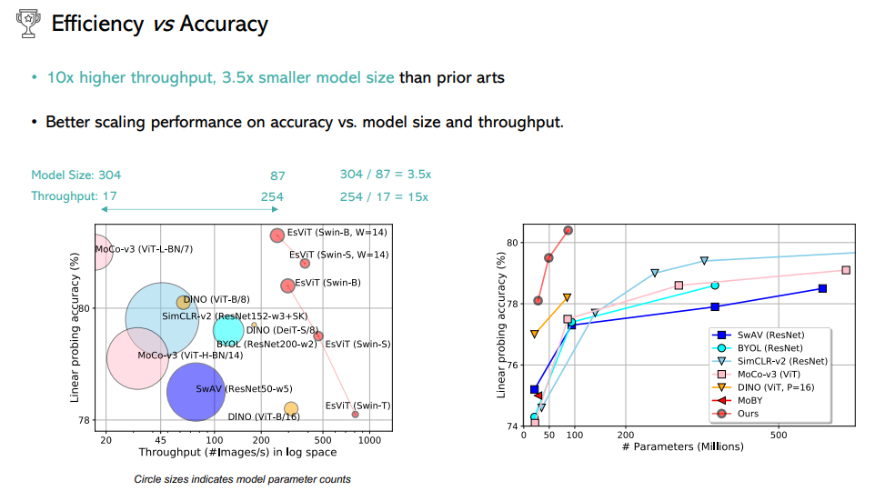](https://chunyuan.li/assets/pdf/esvit_talk_chunyl.pdf)

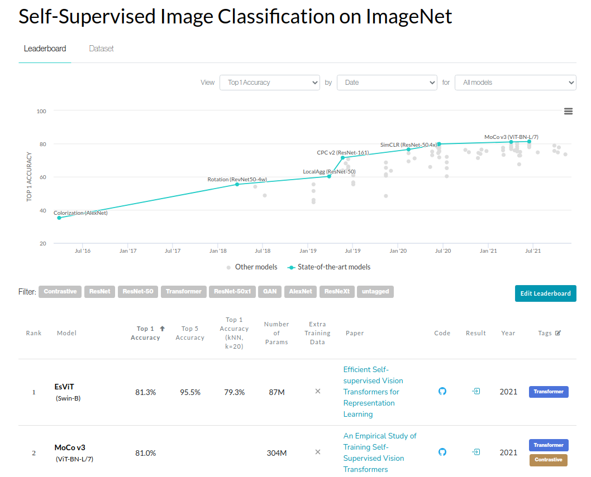
https://paperswithcode.com/sota/self-supervised-image-classification-on
-> https://paperswithcode.com/paper/efficient-self-supervised-vision-transformers

## Getting started with the repo

Downloaded`esvit` as a .zip and added it as a static repo 
(you could have forked or made this as a submodule, now cloned)

Set-up the `venv`:

```
python3.8 -m venv ssl_spectro_venv
source ssl_spectro_venv/bin/activate
pip install --upgrade pip
pip install -r requirements.txt 
```

Manual update now for the PyTorch that you have CUDA 11.x PyTorch 
so you can train/evaluate this on Ampere-generation NVIDIA GPUs (30xx, A100 on AWS, etc)
https://pytorch.org/

```
pip3 install torch==1.10.0+cu113 torchvision==0.11.1+cu113 torchaudio==0.10.0+cu113 -f https://download.pytorch.org/whl/cu113/torch_stable.html
```

[`timm`](https://github.com/rwightman/pytorch-image-models) is "PyTorch image models"

## Getting some sample data

Easiest to get started with the Pytorch Audio data, starting with this https://pytorch.org/tutorials/intermediate/speech_command_recognition_with_torchaudio.html


_https://paperswithcode.com/dataset/speech-commands_

**TODO** add some script just to download the data 

### Preprocessing the data

Input audio is as timeseries, we want to make it spectrograph 2D image (in case of audio, this is now time on _x_ and frequency on _y_, i.e. at what times is tour bassline in case with music)

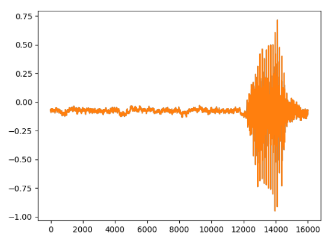

You could use STFT, Matching Pursuits, Wigner-Ville Transform, Wavelets,  or cEEMD, etc., you have some options

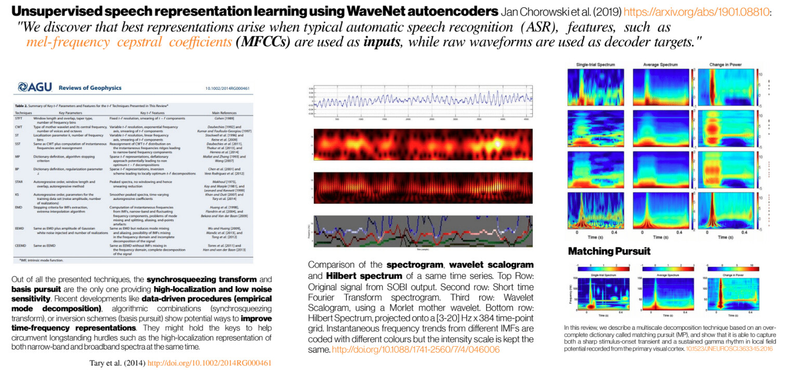

## Using `EsViT`

See the original [README.md](https://github.com/microsoft/esvit), **you need to download the model (1.2 GB)** if you want to use the pretrained models for finetuning, see [models/README.md](models/README.md)

### Test first the pretrained model on your own data

[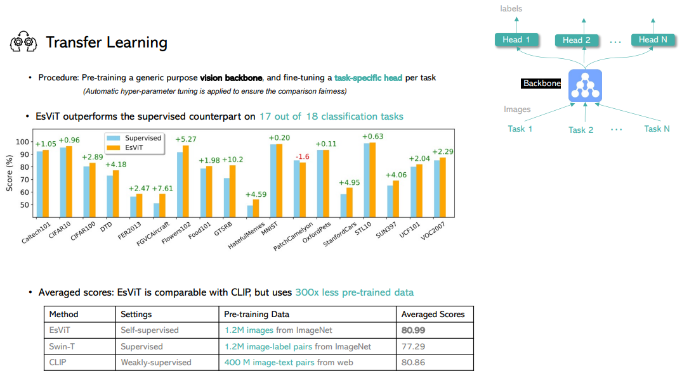](https://chunyuan.li/assets/pdf/esvit_talk_chunyl.pdf)

Replace your project path, other paths are relative to the main path, `=1` with one GPU

```
PROJ_PATH=/home/petteri/PycharmProjects/SSL_spectro
DATA_PATH=$PROJ_PATH/testdata_eval_spectrographs

OUT_PATH=$PROJ_PATH/exp_output/esvit_exp/swin/swin_tiny/bl_lr0.0005_gpu16_bs32_dense_multicrop_epoch300
CKPT_PATH=$PROJ_PATH/exp_output/esvit_exp/swin/swin_tiny/bl_lr0.0005_gpu16_bs32_dense_multicrop_epoch300/checkpoint.pth

cd esvit
python -m torch.distributed.launch --nproc_per_node=1 eval_linear.py --data_path $DATA_PATH --output_dir $OUT_PATH/lincls/epoch0300 --pretrained_weights $CKPT_PATH --checkpoint_key teacher --batch_size_per_gpu 256 --arch swin_tiny --cfg experiments/imagenet/swin/swin_tiny_patch4_window7_224.yaml --n_last_blocks 4 --num_labels 5 MODEL.NUM_CLASSES 0
```

#### Results of the test

As the data is just random spectrograms with no real labels, you don't expect to learn anything, but you can test for getting the code to run through

```
Max accuracy so far: 28.57%
Epoch: [99]  [0/1]  eta: 0:00:00  lr: 0.000000  loss: 1.459668 (1.459668)  time: 0.730301  data: 0.626781  max mem: 705
Epoch: [99] Total time: 0:00:00 (0.806385 s / it)
Averaged stats: lr: 0.000000  loss: 1.459668 (1.459668)
Test:  [0/1]  eta: 0:00:00  loss: 1.452319 (1.452319)  acc1: 28.571430 (28.571430)  acc5: 100.000008 (100.000008)  time: 0.724810  data: 0.620217  max mem: 705
Test: Total time: 0:00:00 (0.799716 s / it)
* Acc@1 28.571 Acc@5 100.000 loss 1.452
Accuracy at epoch 99 of the network on the 28 test images: 28.6%
Max accuracy so far: 28.57%
Training of the supervised linear classifier on frozen features completed.
Top-1 test accuracy: 28.6
```

### Train with the testing data

See the original [README.md](https://github.com/microsoft/esvit#one-node-training)

[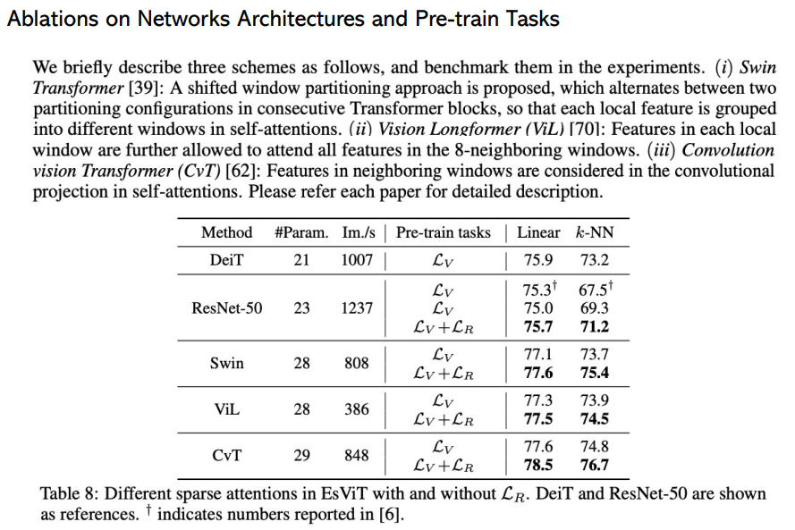](https://chunyuan.li/assets/pdf/esvit_talk_chunyl.pdf)

[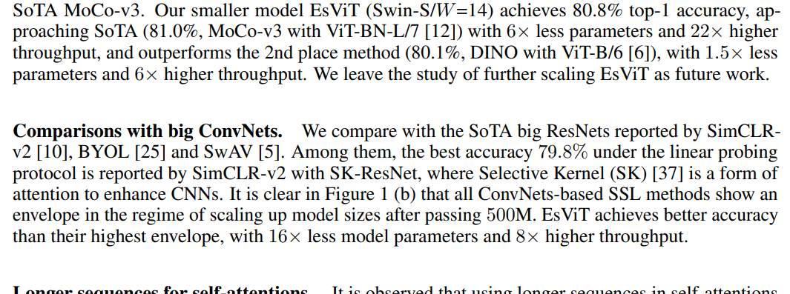](https://arxiv.org/pdf/2106.09785.pdf)

```
PROJ_PATH=/home/petteri/PycharmProjects/SSL_spectro
DATA_PATH=$PROJ_PATH/testdata_eval_spectrographs

OUT_PATH=$PROJ_PATH/output/esvit_exp/ssl/swin_tiny_test_spectro_crap/
python -m torch.distributed.launch --nproc_per_node=1 main_esvit.py --arch swin_tiny --data_path $DATA_PATH/train --output_dir $OUT_PATH --batch_size_per_gpu 2 --epochs 300 --teacher_temp 0.07 --warmup_epochs 10 --warmup_teacher_temp_epochs 30 --norm_last_layer false --use_dense_prediction True --cfg experiments/imagenet/swin/swin_tiny_patch4_window7_224.yaml 
```

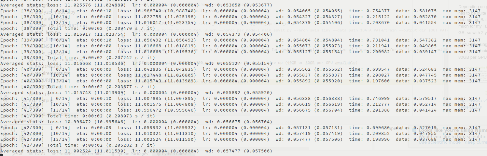

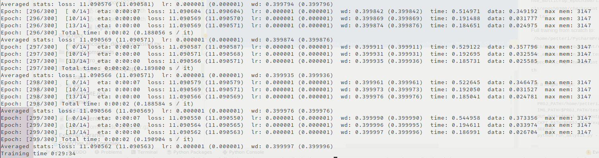

Check out the saving frequency also, one model is ~900 MB and now it is saving every 5th epoch for the 300 epoch training (~60 GB)

Depending on your GPU, the batch size has to be quite low for desktop debugging. Batch size of 4 was too much for my `Laptop 3070` with only 6 GB, so with 2 you got this to work. 

If you are using NVIDIA A100, you can hike up the batch size up (40GB or 80GB per GPU awailable)


_https://www.nvidia.com/en-us/data-center/a100/_

#### Check the training log

See [log.txt](utput/esvit_exp/ssl/swin_tiny_test_spectro_crap/log.txt)

**TODO!** Add Tensorboard logging

### Visualizing the network attention

See original [README.md](https://github.com/microsoft/esvit#analysisvisualization-of-correspondence-and-attention-maps)

Note! Classifier finetuning went to:
`/home/petteri/PycharmProjects/SSL_spectro/exp_output/esvit_exp/swin/swin_tiny/bl_lr0.0005_gpu16_bs32_dense_multicrop_epoch300/lincls/epoch0300/checkpoint.pth.tar`

Full training from scratch to:
`/home/petteri/PycharmProjects/SSL_spectro/output/esvit_exp/ssl/swin_tiny_test_spectro_crap/checkpoint.pth`

#### Single Image

For a single image (note that the original README.md was not updated, use `analyze_models.py` instead of `run_analysis.py` that does not exist):

```
PROJ_PATH=/home/petteri/PycharmProjects/SSL_spectro
IMG_PATH=$PROJ_PATH/testdata_eval_spectrographs/train/random_class1/potato_0.png
OUT_PATH=$PROJ_PATH/output/esvit_exp/ssl/swin_tiny_test_spectro_crap/explanation/
CKPT_PATH=$PROJ_PATH/exp_output/esvit_exp/swin/swin_tiny/bl_lr0.0005_gpu16_bs32_dense_multicrop_epoch300/lincls/epoch0300/checkpoint.pth.tar
SEED=0
python analyze_models.py --arch swin_tiny --image_path $IMG_PATH --output_dir $OUT_PATH --pretrained_weights $CKPT_PATH --learning ssl --seed $SEED --cfg experiments/imagenet/swin/swin_tiny_patch4_window7_224.yaml --vis_attention True --vis_correspondence True MODEL.NUM_CLASSES 0 
```

##### Attention masks

[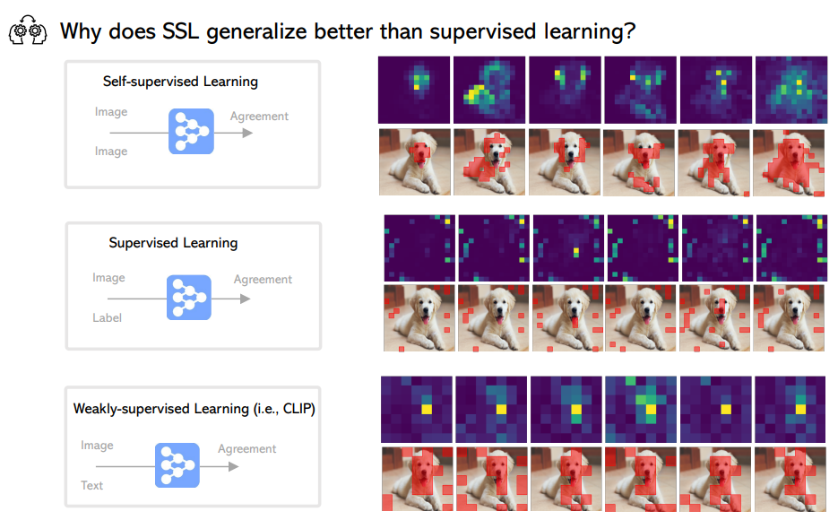](https://chunyuan.li/assets/pdf/esvit_talk_chunyl.pdf)

Input image for visualization

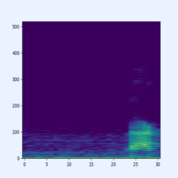

Check what these actually are :D

`attn_all_11_query9.png`:


`attn_masked_all_11_query9.png`:

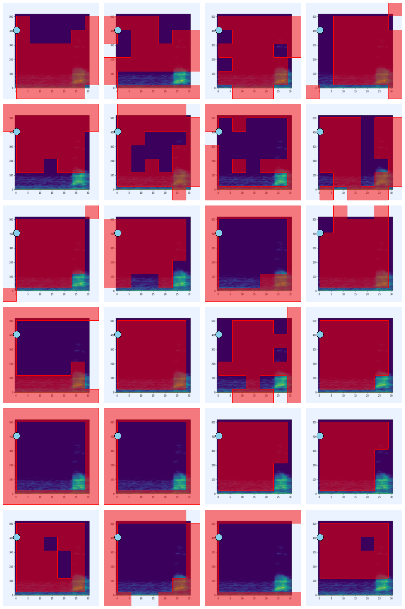

`attn_masked_all_11_query9_compressed.png`:

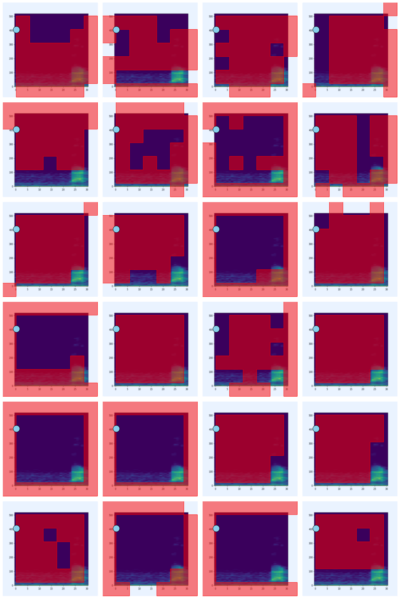

##### Correspondence

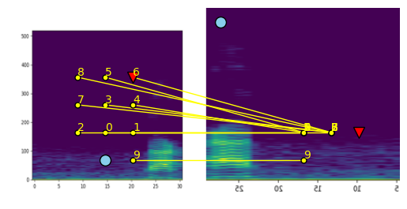

See the [slides](https://chunyuan.li/assets/pdf/esvit_talk_chunyl.pdf) for quick explanation of this plot

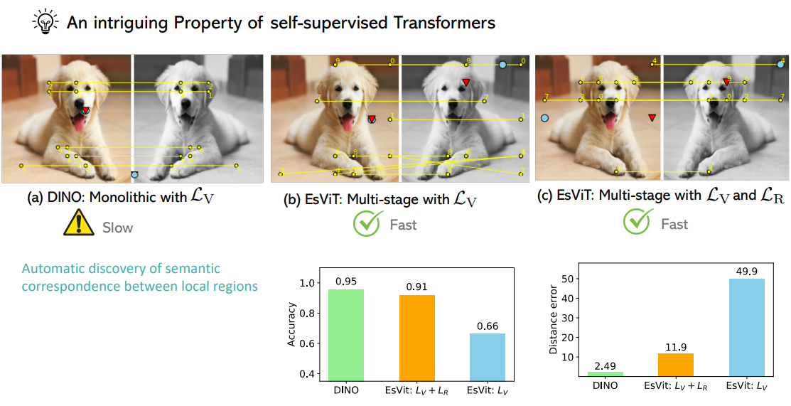

For the dataset:

```
PROJ_PATH=/home/petteri/PycharmProjects/SSL_spectro
DATA_PATH=$PROJ_PATH/testdata_eval_spectrographs/
OUT_PATH=$PROJ_PATH/output/esvit_exp/ssl/swin_tiny_test_spectro_crap/explanation/
CKPT_PATH=$PROJ_PATH/exp_output/esvit_exp/swin/swin_tiny/bl_lr0.0005_gpu16_bs32_dense_multicrop_epoch300/lincls/epoch0300/checkpoint.pth.tar
SEED=0
python analyze_models.py --arch swin_tiny --data_path $DATA_PATH --output_dir $OUT_PATH --pretrained_weights $CKPT_PATH --learning ssl --seed $SEED --cfg experiments/imagenet/swin/swin_tiny_patch4_window7_224.yaml  --measure_correspondence True MODEL.NUM_CLASSES 0 
```

Saves `measure_correspondence.pickle`
