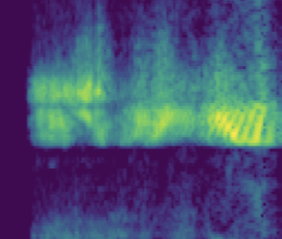

# SSL_transformer

Based on the repo https://github.com/microsoft/esvit


https://paperswithcode.com/sota/self-supervised-image-classification-on
-> https://paperswithcode.com/paper/efficient-self-supervised-vision-transformers

## Getting started with the repo

Downloaded`esvit` as a .zip and added it as a static repo (you could have forked or made this as a submodule, now cloned)

Set-up the `venv`:

```
python3.8 -m venv ssl_spectro_venv
source ssl_spectro_venv/bin/activate
pip install --upgrade pip
pip install -r requirements.txt 
```

Manual update now for the PyTorch that you have CUDA 11.x PyTorch so you can train/evaluate this on Ampere-generation NVIDIA GPUs (30xx, A100 on AWS, etc)
https://pytorch.org/

```
pip3 install torch==1.10.0+cu113 torchvision==0.11.1+cu113 torchaudio==0.10.0+cu113 -f https://download.pytorch.org/whl/cu113/torch_stable.html
```

[`timm`](https://github.com/rwightman/pytorch-image-models) is "PyTorch image models"

## Getting some sample data

Easiest to get started with the Pytorch AUdio data, starting with this https://pytorch.org/tutorials/intermediate/speech_command_recognition_with_torchaudio.html



_https://paperswithcode.com/dataset/speech-commands_

**TODO** add some script just to download the data 

### Preprocessing the data

Input audio is as timeseries, we want to make it spectrograph 2D image (in case of audio, this is now time on _x_ and frequency on _y_, i.e. at what times is tour bassline in case with music)


You could use STFT, Matching Pursuits, Wigner-Ville Transform, Wavelets,  or cEEMD, etc., you have some options


## Using `EsViT`

See the original [README.md](https://github.com/microsoft/esvit)

### Test first the pretrained model on your own data

Replace your project path, other paths are relative to the main path, `=1` with one GPU

```
PROJ_PATH=/home/petteri/PycharmProjects/SSL_spectro
DATA_PATH=$PROJ_PATH/testdata_eval_spectrographs

OUT_PATH=$PROJ_PATH/exp_output/esvit_exp/swin/swin_tiny/bl_lr0.0005_gpu16_bs32_dense_multicrop_epoch300
CKPT_PATH=$PROJ_PATH/exp_output/esvit_exp/swin/swin_tiny/bl_lr0.0005_gpu16_bs32_dense_multicrop_epoch300/checkpoint.pth

cd esvit
python -m torch.distributed.launch --nproc_per_node=1 eval_linear.py --data_path $DATA_PATH --output_dir $OUT_PATH/lincls/epoch0300 --pretrained_weights $CKPT_PATH --checkpoint_key teacher --batch_size_per_gpu 256 --arch swin_tiny --cfg experiments/imagenet/swin/swin_tiny_patch4_window7_224.yaml --n_last_blocks 4 --num_labels 5 MODEL.NUM_CLASSES 0
```

### Train with your own data


